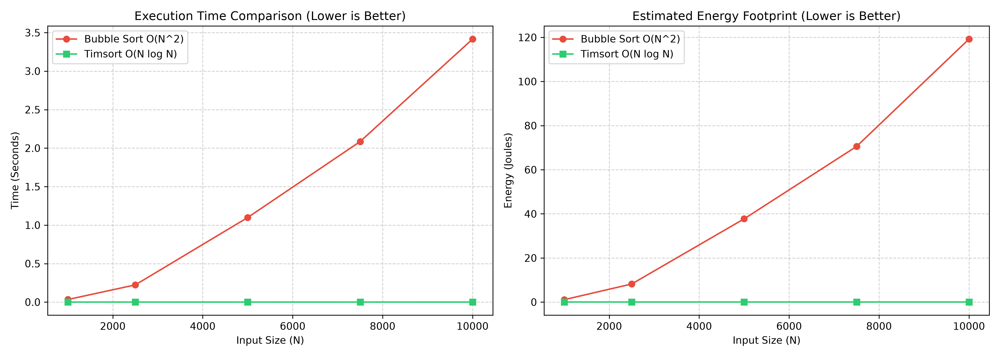

# Green-Cloud-Profiler 🌿⚡

A lightweight, modular Python utility designed to profile CPU utilization, execution runtime, peak memory consumption, and estimated energy footprints of algorithmic workloads. Built to evaluate software efficiency for green computing applications.

---

## 📊 Benchmark Visualizations

The profiler compares computational workloads (e.g., $O(N^2)$ Bubble Sort vs. $O(N \log N)$ Timsort) across scaled input sizes ($N = 1,000$ to $10,000$) to measure energy divergence:



---

## 🛠️ Architecture

* **`profiler.py`**: Core resource monitoring engine using system CPU clocks and memory tracking via `psutil`.
* **`benchmark.py`**: Automated runner to profile algorithmic workloads across varying input sizes.
* **`plot_result.py`**: Performance visualizer generating time and energy comparative graphs using `matplotlib`.

---

## 🚀 Quickstart

```bash
# Install dependencies
pip install psutil matplotlib

# Run benchmark suite
python benchmark.py

# Generate performance visualization
python plot_result.py